# ⚗️ Interfacial Chemistry-Driven Self-Assembly of Hierarchical 3D / Low-Dimensional Lead Halide Perovskites

> **SBPMat / B-MRS Meeting 2026 — Curitiba, Brazil**  
> **Raphaella T. S. Gonçalves¹ · André L. M. Freitas¹**  
> ¹ Federal University of ABC (UFABC)

[](#)
[](#)
[](#)
[](#)

<p align="center">
  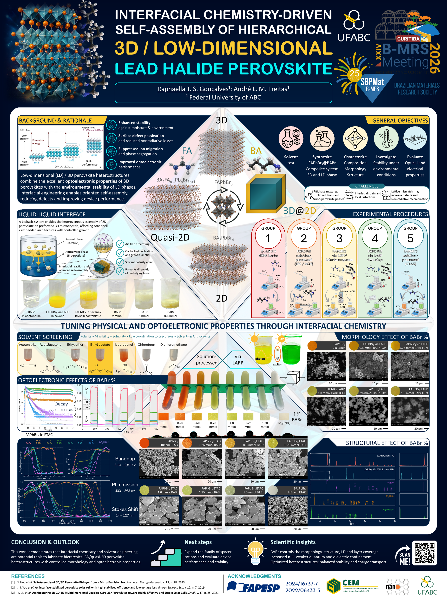
</p>

## 🌌 From interfaces to hierarchical perovskites

This project explores **interfacial chemistry and solvent engineering as tools to drive the self-assembly of hierarchical 3D / low-dimensional lead-halide perovskites**.

The central concept is simple:

**3D FAPbBr₃** provides strong optoelectronic performance, while **low-dimensional (LD) phases** can contribute enhanced environmental stability and surface passivation.

Instead of treating these phases independently, the work investigates how a **liquid–liquid interface** can guide their heterogeneous assembly into architectures such as **quasi-2D and 3D@2D structures**, with morphology and optoelectronic properties tuned through the interfacial environment.

---

## 🎯 The scientific question

### Can we use the chemistry of the interface to control *where*, *how* and *how much* low-dimensional perovskite forms?

The study systematically investigates:

- 🧴 **Solvent polarity, miscibility and solubility**
- 🧪 **BABr concentration**
- 🧱 **Nucleation and growth kinetics**
- 🔬 **Morphology and structure**
- 💡 **Optical and optoelectronic response**
- 🌦️ **Stability under environmental conditions**

The target system is a hierarchical architecture based on:

<p align="center">
  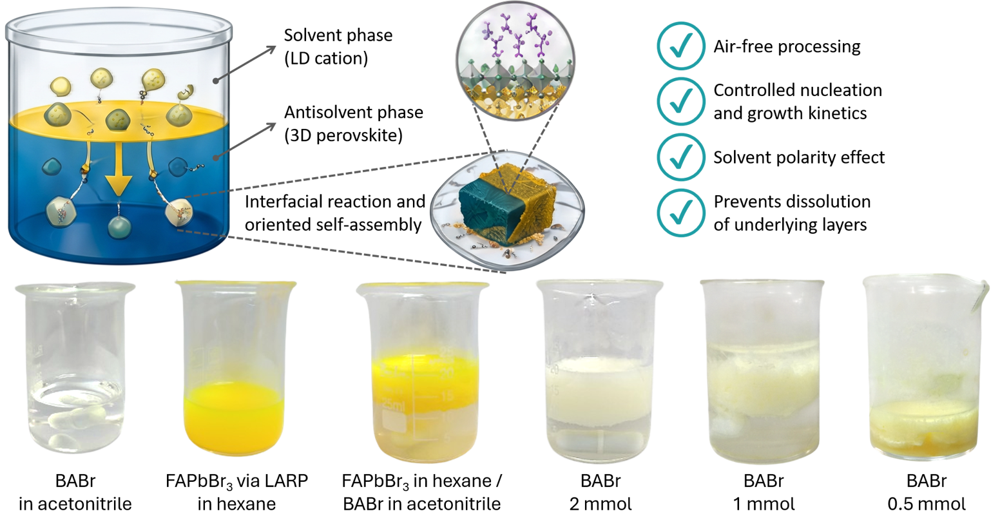
</p>

---

## 🧩 Why a liquid–liquid interface?

A biphasic system enables the heterogeneous assembly of a low-dimensional perovskite phase on preformed 3D microcrystals, potentially generating **core–shell / embedded architectures with controlled growth**.

<p align="center">
  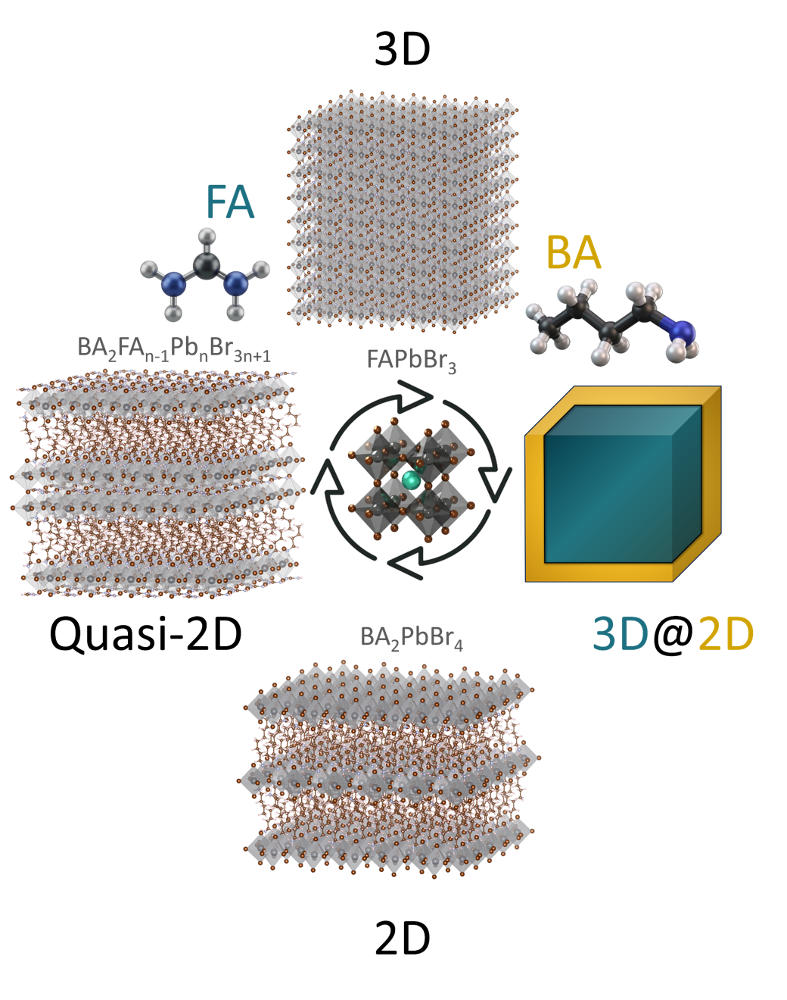
</p>

### The interface is designed to provide

| Interfacial feature | Expected role |
|---|---|
| ⚗️ Solvent polarity | Controls precursor environment and phase formation |
| 🔄 Limited miscibility | Maintains spatially distinct phases |
| 🧲 Low coordination to precursors | Helps regulate precursor availability |
| 🧫 Controlled nucleation | Influences heterogeneous growth |
| 🛡️ Reduced dissolution | Helps preserve the underlying 3D phase |

**Design principle:**  
> **Tune the interface → tune nucleation and growth → tune structure → tune properties.**

---

# 🔬 Experimental strategy

The work compares multiple synthetic routes toward FAPbBr₃-based hierarchical structures and a BAFA low-dimensional series.

<p align="center">
  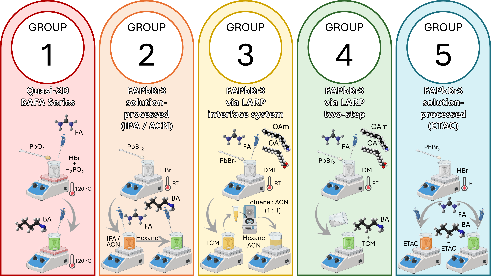
</p>

### Workflow

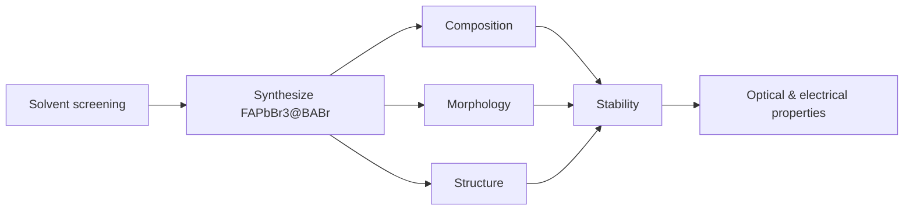

The experimental design includes solution-processed and LARP-based FAPbBr₃ routes, followed by BABr incorporation at different concentrations.

---

# 🧴 Solvent screening

The antisolvent / solvent environment is a key variable because **polarity, miscibility, solubility and coordination with precursors** influence precipitation and interfacial growth.

<p align="center">
  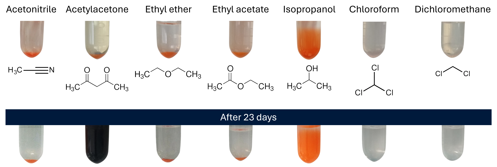
</p>

The screened solvents include:

**Acetonitrile · Acetylacetone · Ethyl ether · Ethyl acetate · Isopropanol · Chloroform · Dichloromethane**

The study then focuses on conditions that enable controlled interfacial assembly without simply dissolving or disrupting the underlying 3D perovskite.

---

# 🧪 BABr as a structural tuning knob

A central variable is the amount of **BABr**, explored from:

**0 → 0.25 → 0.50 → 0.75 → 1.00 → 1.25 → 1.50 mmol**

Increasing the low-dimensional cation content changes the balance between:

```text
FA-rich / 3D-like
        ↓
quasi-2D
        ↓
LD-rich / 2D-like
```
**The gradient of color from orange (FA-rich) to greenish (BA-rich) is observed in both dispersion and powder forms:**

<p align="center">
  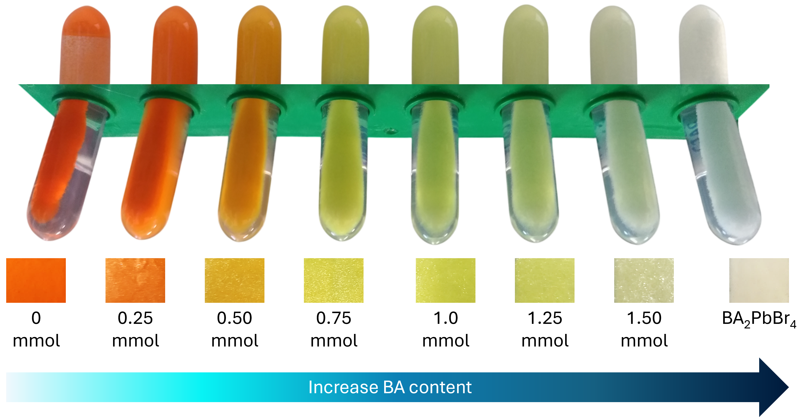
</p>

The poster identifies BABr as a key parameter controlling:

- morphology;
- structure;
- low-dimensional phase formation;
- layer coverage;
- optoelectronic response.

---

# 🔬 Morphology: the interface leaves a fingerprint

<p align="center">
  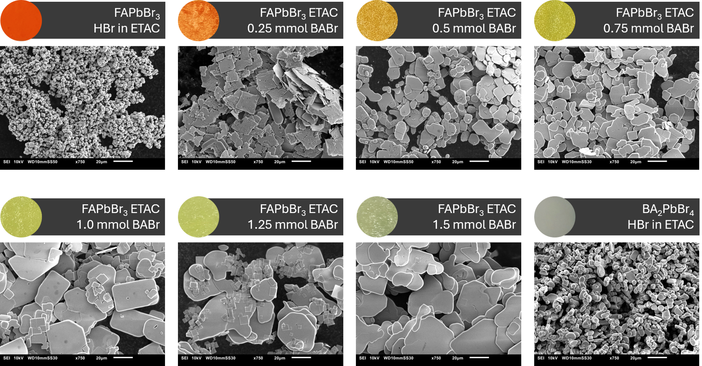
</p>

SEM analyses reveal that altering the BABr content modifies the morphology from small cuboids to a lamellar shape.

---

# 📊 Structure: the transition from FA-rich to BA-rich phase

<p align="center">
  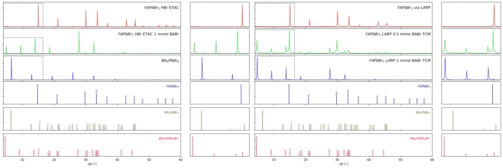
</p>

XRD analyses reveal that changing the BABr content modifies the structure from 3D to quasi-2D as the BABr content increases, with the secondary phase disappearing.

<table>
<tr>
<td align="center">

### 🧠 KEY SCIENTIFIC INSIGHT

**“More BABr ≠ simply more 2D.”**

The key point is that **interfacial chemistry couples composition to nucleation, growth, morphology, and structural organization**.

<br>

**COMPOSITION → INTERFACIAL CHEMISTRY → NUCLEATION & GROWTH → STRUCTURE → PROPERTIES**

</td>
</tr>
</table>

<!--
The important point is not simply **“more BABr = more 2D”**, but that the **interfacial chemistry couples composition to nucleation, growth, morphology and structural organization**.
-->

---

# 💡 Optoelectronic effects

<p align="center">
  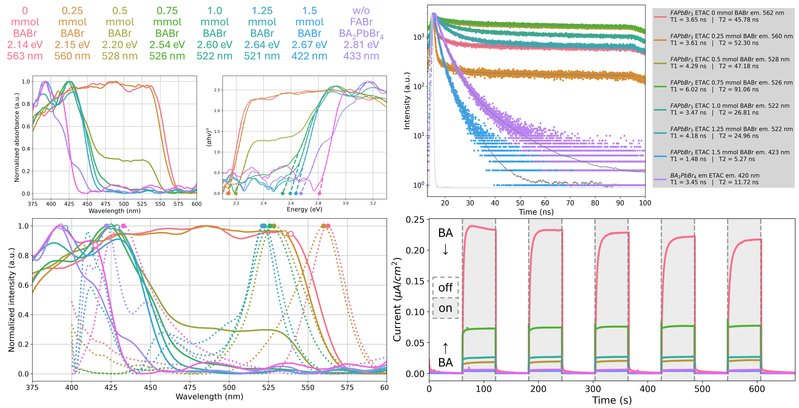
</p>

The poster reports substantial tuning of the optical response across the investigated compositions:

| Property | Reported range |
|---|---:|
| **Bandgap** | **2.14 – 2.81 eV** |
| **PL emission** | **433 – 563 nm** |
| **Decay time** | **5.27 – 91.06 ns** |
| **Stokes shift** | **24 – 127 nm** |

These trends connect the **chemical environment at the interface** to changes in the structural and optoelectronic landscape of the perovskite.

---

# 💧 Contact Angle Measurements

Contact angle measurements of FAPbBr₃ perovskite films with increasing BABr content in ETAC (0.25–1.5 mmol). The results illustrate the evolution of surface wettability as the BABr concentration increases, compared with pristine FAPbBr₃ and the BA₂PbBr₄ reference.

<p align="center">
  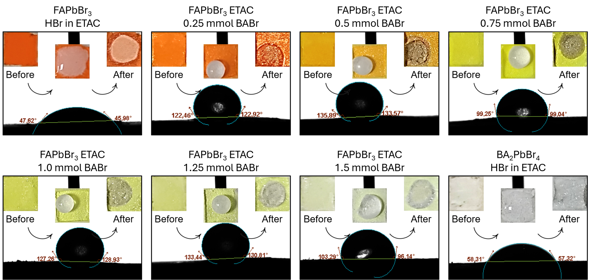
</p>


# ⚙️ Scientific method

The workflow developed in this study is:

```text
       BABr concentration
              │
              ▼
     Interfacial chemistry
              │
       ┌──────┴──────┐
       ▼             ▼
   Nucleation      Growth
       │             │
       └──────┬──────┘
              ▼
     3D / quasi-2D / 2D
        architecture
              │
       ┌──────┴──────┐
       ▼             ▼
   Morphology      Structure
       │             │
       └──────┬──────┘
              ▼
     Optoelectronic
        properties
              │
              ▼
     Stability ↔ Charge
        transport
```

### The key idea

> **Interfacial chemistry is not just a processing detail — it becomes a materials-design parameter.**

---

# ⚠️ Challenges

The hierarchical assembly also introduces important challenges:

- **Biphase mixtures, solid solutions and non-perovskite phases**
- **Interfacial strain and local distortions**
- **Lattice mismatch**, potentially increasing defects and non-radiative recombination
- **Interfacial reactions and uncontrolled oriented self-assembly**

Therefore, the objective is not to maximize the low-dimensional phase, but to identify an **optimized heterostructure** that balances stability and charge transport.

---

# 🚀 Conclusion & outlook

This work demonstrates that **interfacial chemistry and solvent engineering are promising tools for fabricating hierarchical 3D/quasi-2D perovskite heterostructures with controlled morphology and optoelectronic properties**.

### 📈 Next steps

- Expand the family of **spacer cations**
- Evaluate **device performance**
- Investigate **stability**
- Refine the relationship between **interface → structure → properties**

### ✅ Scientific takeaway

**BABr concentration acts as a powerful structural and optoelectronic tuning parameter**, while the solvent/interface environment provides an additional degree of control over self-assembly.

---

## 📚 References

1. Y. Hou et al. **Self-Assembly of 0D/3D Perovskite Bi-Layer from a Micro-Emulsion Ink.** *Advanced Energy Materials*, 13, 28 (2023).
2. J. J. Yoo et al. **An interface stabilized perovskite solar cell with high stabilized efficiency and low voltage loss.** *Energy & Environmental Science*, 12, 7 (2019).
3. K. Liu et al. **Architecturing 1D-2D-3D Multidimensional Coupled CsPbI₂Br Perovskites toward Highly Effective and Stable Solar Cells.** *Small*, 17, 25 (2021).

---

## 👩‍🔬 Authors & affiliations

**Raphaella T. S. Gonçalves¹**  
**André L. M. Freitas¹**

¹ Federal University of ABC — **UFABC**

**Research context:** Nanosciences & Advanced Materials · Lead-halide perovskites · Interfacial chemistry · Self-assembly · Optoelectronic materials

---

## 🪧 Presented at

**XXIV SBPMat / B-MRS Meeting 2026**  
📍 Curitiba, Brazil

<p align="center">
  <b>INTERFACE → SELF-ASSEMBLY → STRUCTURE → PROPERTIES</b>
</p>
